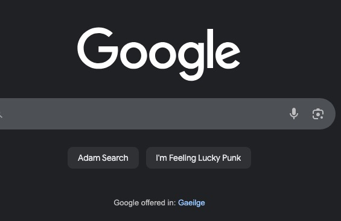

The following are the exercises:

- Set up a work environment 
    - I will work in VSCode in this module
- Download images 
    - I followed the guide and used *save image as..* to download
    - I created the folder using mkdir in the VSCode terminal
    - Generally to download images I find an image then use
        - inspect > right click on html tag for the image > capture node screenshot
- HTML pages
    - Copied the html into the index.html and apps.html files
- CSS 
    - Typed in the CSS code myself as a refresher (I learned this before)
- The Chrome Dev Console
    - Changed the instructions on the tutors.dev page to say "Just take it easy" 
    for this exersie

- Exercises:
    
    - Exercise 1: Download the “Source Code” from the above link. This is a zipped archive of the completed lab. See if you can uncompress (unzip) the archive. This can usually be accomplished just by double clicking it. The unzipped archive will be contained in a folder called “bundle-store”. Now, relocate (drag/drop perhaps) this unzipped archive to somewhere else on your workstation. Perhaps consider creating a new folder called “solutions” inside the “web-development” folder, and place the solution in there.
        -Open the solution project, both in Sublime and a browser.
    
    - Exercise 2: Just to get used to the editor, create a few more new apps in the ‘apps.html’, perhaps you can locate content from some web source (including images). For instance here: https://setapp.com/apps
        - Try to identify and replicate the way the code is indented in the existing content.

    - Exercise 3: Incorporate content into a new directions.html page. It can contain any content you think would be useful. Incorporate a link from index to this page.

    - Exercise 4: Currently you may not have the CSS file ‘linked’ to app.html or the directions.html page. i.e. only index.html is styled with the css rules you have defined. See if you can link the other pages now.
    
    - Exercise 5: If you are finding initial contact with HTML a little challenging - this is an excellent starter resource to review:
        - https://developer.mozilla.org/en-US/docs/Learn/Getting_started_with_the_web/HTML_basics
    It is short read.

    - Exercise 5: In this lab you used the element ul in the index page.Investigate the use of <ol> , find out the differences between these elements here: https://developer.mozilla.org/en-US/docs/Learn/CSS/Styling_text/Styling_lists
        - My solution: ul is an unordered list (bullet points). ol is an ordered list (a numbered list)

    - Exercise 6: Go to any website, say for instance, Google. Open up the Dev console and experiment if you can change the content of the page. For instance, try to change the some text or some style. Can you change the font size? Google may be too complicated, feel free to pick another site.
        - My solution: 
